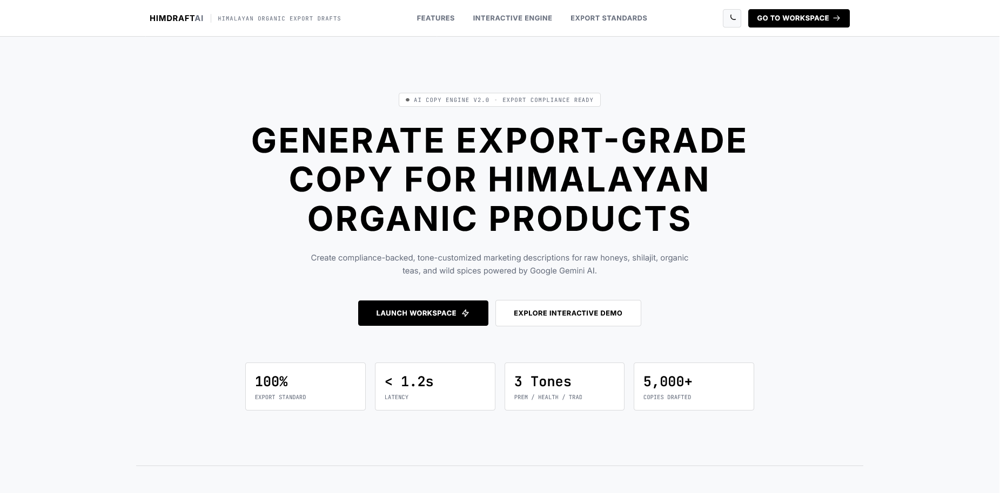
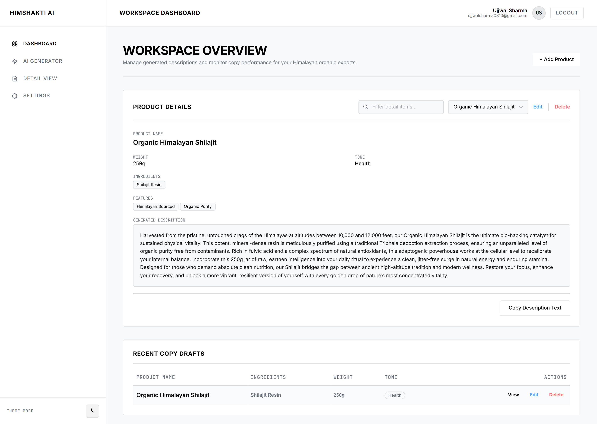
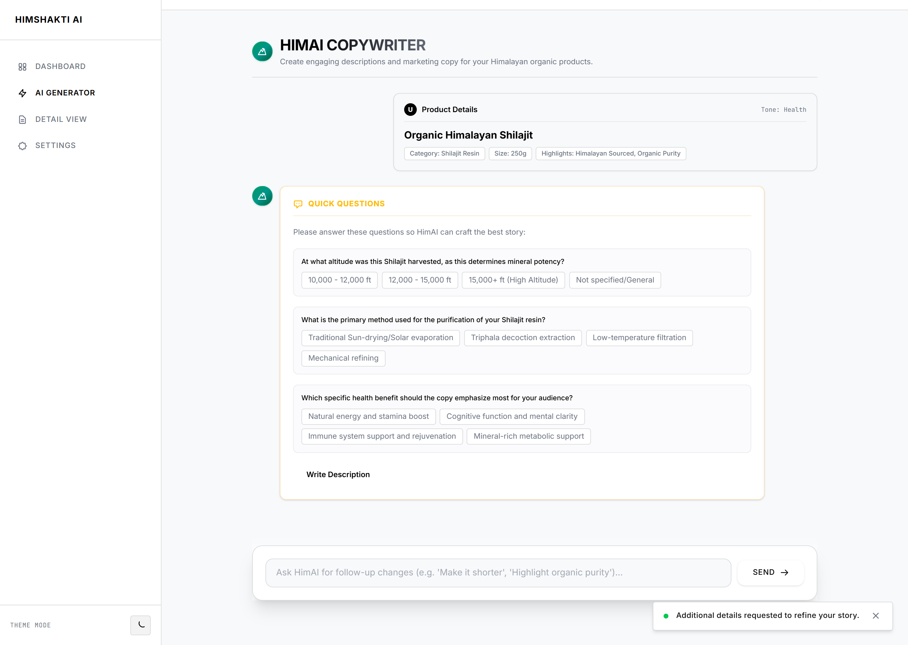
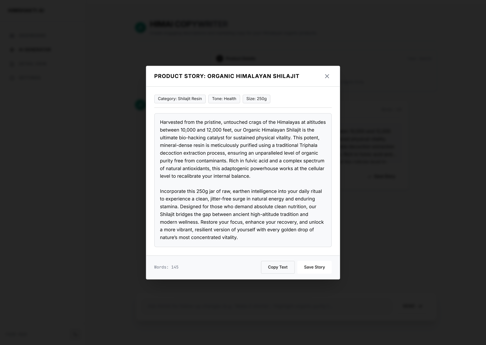

# HimDraft AI Product Copy Generator

An AI-powered workspace for creating, refining, and managing compelling e-commerce product descriptions for Himalayan food and wellness products.

## Live Demo

[https://him-draft-ai.vercel.app/](https://him-draft-ai.vercel.app/)

## Screenshots

### Landing page



### Dashboard



### Product copywriter



### Generated product description



## Features

- Creates 100–150 word, e-commerce-ready product descriptions for Himalayan food and wellness products.
- Supports premium, traditional, and health-focused writing tones.
- Detects sparse product information and asks tailored follow-up questions before generating copy.
- Captures product name, ingredients, weight, product features, and optional clarification answers.
- Lets authenticated users save, view, edit, delete, and search their generated descriptions.
- Provides email/password registration and login, plus Google OAuth sign-in.
- Keeps every user’s saved descriptions isolated behind JWT-protected API routes.

## Tech Stack

| Area | Technology |
| --- | --- |
| Frontend | React 19, TypeScript, Vite, React Router, Tailwind CSS |
| Backend | Node.js, Express 5, TypeScript, Zod |
| Database | MongoDB Atlas with Mongoose |
| AI | Google Gemini via `@google/generative-ai` (`gemini-3.1-flash-lite`) |
| Authentication | JWT, bcrypt, Passport, Google OAuth 2.0 |
| Deployment | Vercel (frontend), Render (backend) |

## Setup Instructions

### Prerequisites

- Node.js 18 or later
- npm
- A MongoDB database (local MongoDB or MongoDB Atlas)
- A Gemini API key
- Google OAuth credentials if you want to enable Google sign-in

### 1. Clone the repository

```bash
git clone https://github.com/UjjwalSharma0112/HimShakti-AI-Product-Copy-Generator.git
cd HimShakti-AI-Product-Copy-Generator
```

### 2. Configure and run the backend

```bash
cd backend
copy .env.example .env
npm install
npm run dev
```

On macOS/Linux, use `cp .env.example .env` in place of `copy`.

Set the following values in `backend/.env`:

```env
NODE_ENV=development
PORT=8080
CLIENT_URL=http://localhost:5173
MONGO_URI=mongodb://127.0.0.1:27017/himdraftai
JWT_SECRET=replace-with-a-long-random-secret
GEMINI_API_KEY=your-gemini-api-key

# Optional: required only for Google OAuth
GOOGLE_CLIENT_ID=your-google-client-id.apps.googleusercontent.com
GOOGLE_CLIENT_SECRET=your-google-client-secret
GOOGLE_CALLBACK_URL=http://localhost:8080/api/auth/google/callback
```

The API starts at `http://localhost:8080`.

### 3. Configure and run the frontend

Open a second terminal from the repository root, then run:

```bash
cd frontend
copy .env.example .env
npm install
npm run dev
```

Set `frontend/.env` to point at your local API:

```env
VITE_API_URL=http://localhost:8080/api
```

Open [http://localhost:5173](http://localhost:5173). For a production build, use `npm run build` in both `backend` and `frontend`; start the compiled backend with `npm start`.

## API Documentation

The base URL is `http://localhost:8080/api` locally. All `/descriptions` and `/ai` routes require `Authorization: Bearer <jwt>`.

### Health

`GET /health`

```json
{ "status": "ok", "timestamp": "2026-08-07T10:00:00.000Z" }
```

### Authentication

`POST /auth/register`

```json
{ "name": "Asha", "email": "asha@example.com", "password": "secret123", "confirmPassword": "secret123" }
```

```json
{ "message": "User registered successfully", "user": { "id": "...", "name": "Asha", "email": "asha@example.com", "provider": "local" } }
```

`POST /auth/login`

```json
{ "email": "asha@example.com", "password": "secret123" }
```

```json
{ "token": "<jwt>", "user": { "id": "...", "name": "Asha", "email": "asha@example.com", "provider": "local" } }
```

`GET /auth/google` starts the Google OAuth flow; `GET /auth/google/callback` completes it and redirects back to the frontend.

### AI copy generation

`POST /ai/generate`

```json
{
  "productName": "Raw Himalayan Honey",
  "ingredients": ["Raw honey"],
  "weight": "500 g",
  "features": ["Wild-harvested", "Unprocessed"],
  "tone": "traditional"
}
```

The response either asks for details:

```json
{ "isVague": true, "clarifications": [{ "id": "harvest_method", "question": "How is it harvested?", "options": ["..."], "allowCustom": true }] }
```

or returns generated copy:

```json
{ "isVague": false, "copy": "Harvested from the Himalayan foothills..." }
```

Send an `answers` object with the original payload to generate after clarification.

### Saved descriptions

| Endpoint | Purpose |
| --- | --- |
| `GET /descriptions` | List the signed-in user’s saved descriptions. |
| `GET /descriptions/search?q=honey` | Search saved descriptions by product name. |
| `GET /descriptions/:id` | Retrieve one saved description. |
| `POST /descriptions` | Save a description payload. |
| `PUT /descriptions/:id` | Update a saved description. |
| `DELETE /descriptions/:id` | Delete a saved description; returns `204 No Content`. |

Example create request:

```json
{
  "productName": "Raw Himalayan Honey",
  "ingredients": ["Raw honey"],
  "weight": "500 g",
  "features": ["Wild-harvested"],
  "tone": "traditional",
  "generatedDescription": "Harvested from the Himalayan foothills..."
}
```

## Architecture / Folder Structure

```text
.
├── frontend/                 # React single-page application
│   └── src/
│       ├── api/              # API client modules
│       ├── components/       # Reusable UI and product components
│       ├── context/          # Authentication state
│       ├── pages/            # Landing, dashboard, generator, detail, and auth pages
│       └── layouts/          # Authenticated workspace layout
├── backend/                  # Express API
│   └── src/
│       ├── auth/             # Local and Google OAuth authentication
│       ├── controller/       # HTTP request handlers
│       ├── models/           # Mongoose models
│       ├── routes/           # AI and description endpoints
│       ├── services/         # Gemini generation and persistence logic
│       └── middleware/       # JWT, rate limiting, and error handling
└── *.png                     # README screenshots and schema asset
```

The browser app communicates with the Express REST API. The API authenticates users, persists descriptions in MongoDB, and calls Gemini to assess product details and produce the final copy.

## Known Limitations

- Render’s free tier can sleep after inactivity, so the first API request may take roughly 30–60 seconds.
- Generated copy depends on Gemini availability, quotas, and the quality of the product details supplied.
- If Gemini’s clarification-analysis call fails, the app proceeds directly to copy generation to avoid blocking the user.
- There are no automated test suites or CI checks in the repository yet.
- Saved content is currently organized as individual descriptions; collaboration, version history, exports, and analytics are not yet implemented.
- Google OAuth requires correctly configured Google Cloud redirect URIs and environment variables.

## Credits & Acknowledgements

- [Google Gemini](https://ai.google.dev/) powers product-detail analysis and copy generation.
- [MongoDB Atlas](https://www.mongodb.com/atlas) provides the managed document database.
- [Vercel](https://vercel.com/) and [Render](https://render.com/) support deployment.
- Built with the React, Vite, Express, Mongoose, Passport, and Tailwind CSS ecosystems.
- Product-copy prompts and the UI workflow were shaped with AI-assisted development tools, including OpenAI Codex.
