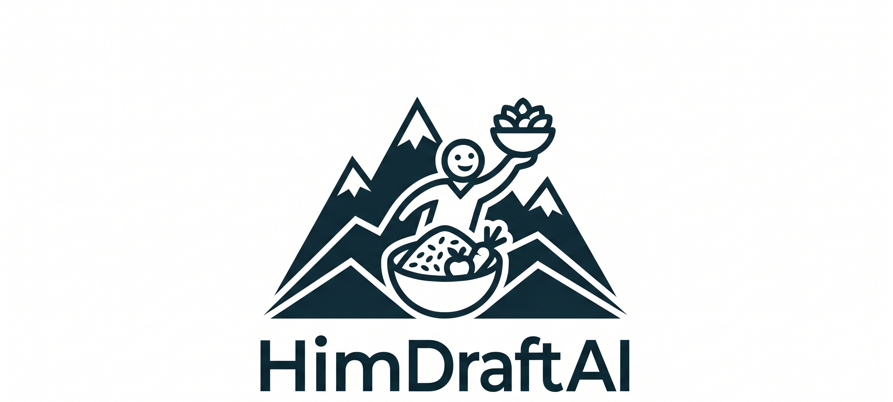
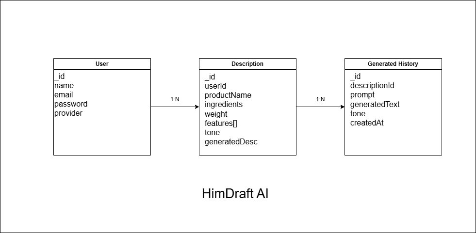

# HimShakti AI Product Copy Generator

AI-powered e-commerce product description generator for traditional Himalayan food products.



## Tech Stack

- **Frontend**: React + Vite
- **Styling**: Tailwind CSS
- **Backend**: Express.js + TypeScript
- **Database**: MongoDB (Mongoose ORM)
- **AI API**: Gemini API
- **Deployment**: Vercel + Render

---

## Database Architecture

### Why We Chose MongoDB Atlas
For HimDraftAI, we selected **MongoDB Atlas** as our primary database. Because the core of the application deals with generating rich, unstructured, and highly variable product information (ranging from lists of organic ingredients to changing product feature tags, and multiple versions of AI-generated marketing copy), a document-oriented database fits our data model perfectly. 

Using MongoDB's flexible, schema-less approach allows us to iterate rapidly. We can expand our product descriptions, add rich analytics logs, or introduce new metadata schemas down the line without needing to perform slow or risky database schema migrations.

### Schema Diagram
The database relationships and schema structure are outlined below:



---

## Getting Started

### Prerequisites
- Node.js (v18 or higher)
- npm or yarn
- A running MongoDB instance (locally or hosted on MongoDB Atlas)

### Setting Up the Database

1. **Get your MongoDB Connection URI**:
   - **Local instance**: Ensure MongoDB is running locally. Your connection URL will typically be `mongodb://localhost:27017/himdraftai`.
   - **MongoDB Atlas cloud instance**: Sign up on [MongoDB Atlas](https://www.mongodb.com/cloud/atlas), spin up a free tier cluster, create a database user with read/write access, and copy your connection string (e.g. `mongodb+srv://<username>:<password>@cluster0.xxxx.mongodb.net/himdraftai`).

2. **Configure Environment Variables**:
   - Navigate to the `backend` directory.
   - Copy `.env.example` to create your own local `.env` configuration file:
     ```bash
     cp .env.example .env
     ```
   - Open the `.env` file and set the `MONGO_URI` variable to your connection string:
     ```env
     PORT=8080
     MONGO_URI=mongodb://localhost:27017/himdraftai
     ```

3. **Start the Backend**:
   - Run the development server from the `backend` directory:
     ```bash
     npm run dev
     ```
   - The console will log `MongoDB connected` upon a successful connection to the database.

### Running the Frontend
1. Navigate to the `frontend` directory.
2. Install the frontend dependencies and run the development server:
   ```bash
   npm install
   npm run dev
   ```
3. Open your browser and navigate to the local URL (usually `http://localhost:5173`).
